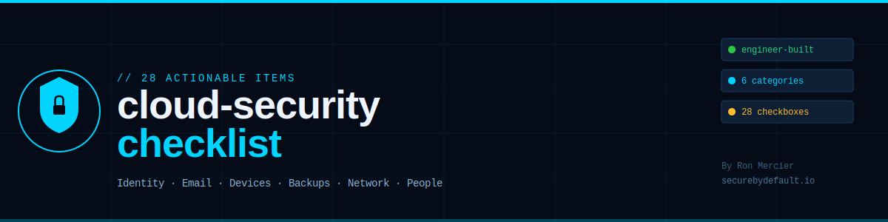

# cloud-security-checklist

**A practical, engineer-built security checklist for cloud infrastructure, small businesses, and self-hosted environments.**

Most security checklists are written by compliance teams for compliance teams. This one is different. It was built by a Cloud & Cybersecurity Engineer who watched a brand-new server get probed by bots within 24 hours of going live — before a single link was published. Every item on this list exists because a real attack exploited the gap it covers.

> 📖 **The attack story behind this checklist:** [My Server Was Attacked Within 24 Hours of Going Live](https://securebydefault.io/blog/server-attacked-24-hours-live/)
>
> 📥 **Free formatted PDF version:** [Download at SecureByDefault.io](https://securebydefault.io/checklist.pdf)

---



---

## What This Covers

28 actionable items across 6 categories — written for real people running real infrastructure, not enterprise compliance officers.

| # | Category | Items | Focus |
|---|---|---|---|
| 1 | Identity & Access | 5 | MFA, password managers, credential hygiene |
| 2 | Email & Phishing Defense | 4 | SPF/DKIM/DMARC, AI phishing awareness |
| 3 | Devices & Updates | 5 | Patching, EDR, encryption, EOL systems |
| 4 | Backups & Recovery | 4 | 3-2-1 rule, immutable backups, restore testing |
| 5 | Network & Cloud | 4 | Firewall, exposed storage, credential file exposure |
| 6 | People & Process | 5 | Incident response, dark web monitoring, vendor risk |

---

## Priority Order — If You're Starting From Scratch

```
TIER 1 — Do these today (stops the majority of attacks)
  [x] Enable MFA everywhere
  [x] Get a password manager — eliminate reuse
  [x] Set up automated, tested backups (3-2-1 rule)

TIER 2 — Do these this week
  [x] Configure SPF + DKIM + DMARC on your domain
  [x] Enable automatic OS and app updates
  [x] Verify cloud storage is not publicly exposed
  [x] Confirm no credential files are web-accessible

TIER 3 — Do these this month
  [x] Enable disk encryption on all laptops
  [x] Write a one-page incident response plan
  [x] Review and disable unused / old accounts
  [x] Retire any end-of-life systems

TIER 4 — Quarterly
  [x] Test restore from backup (not just the backup — the restore)
  [x] Run a 30-minute tabletop incident exercise
  [x] Review vendor and third-party access
  [x] Check dark web for leaked credentials
```

---

## The Full Checklist

### 1. Identity & Access
*Stolen credentials are the #1 way attackers get in.*

- [ ] **[CRITICAL] MFA enabled** on email, banking, cloud platforms, and every admin account
  - Use an authenticator app or hardware key. SMS can be bypassed via SIM-swap.
- [ ] **[CRITICAL] Password manager in use** — no password reused across any two accounts
  - If you can remember it, it's probably not strong enough.
- [ ] **Default credentials changed** on routers, IoT devices, and any new hardware
  - Factory defaults are publicly documented. Change them before connecting.
- [ ] **Least-privilege access applied** — people only reach systems their role requires
  - Limited accounts = limited blast radius when compromised.
- [ ] **Old and unused accounts disabled** — especially former employees and contractors
  - Departing employees lose access the same day they leave.

---

### 2. Email & Phishing Defense
*AI has killed the typo tell. Modern phishing is indistinguishable from real email.*

- [ ] **Advanced spam and threat filtering active** — beyond your provider's default
- [ ] **[CRITICAL] SPF, DKIM, and DMARC configured** on your domain
  - Without DMARC, anyone can send email appearing to come from your domain.
  - Verify at: https://mxtoolbox.com/dmarc.aspx
- [ ] **Team trained on red flags** — urgency, unexpected attachments, lookalike domains
  - Run a phishing simulation annually. People who fail need training, not blame.
- [ ] **[CRITICAL] Financial requests verified out-of-band** — phone call before any wire transfer
  - Business Email Compromise causes billions in losses annually. A 30-second call prevents it.

---

### 3. Devices & Updates
*The window between "CVE published" and "exploit in the wild" is days, not months.*

- [ ] **[CRITICAL] Automatic updates enabled** on OS, browsers, and apps
  - Automation removes the human single point of failure. Review logs monthly.
- [ ] **Modern endpoint protection (EDR) installed** on every device — not just antivirus
  - EDR watches behavior. Traditional AV matches a list. The difference matters.
- [ ] **[CRITICAL] End-of-life systems retired** — unsupported software = unpatched CVEs
  - Upgrade or isolate. Running EOL software is an unpatched CVE factory.
- [ ] **Disk encryption on** for laptops and mobile devices (BitLocker, FileVault)
  - A stolen encrypted laptop is a paperweight. An unencrypted one is a breach.
- [ ] **Screens lock automatically** after short idle period on all work devices

---

### 4. Backups & Recovery
*A backup you've never tested is not a backup — it's a hope.*

- [ ] **[CRITICAL] 3-2-1 rule followed**
  - 3 copies · 2 storage types · 1 off-site or offline
  - Cloud sync (Dropbox, OneDrive) does NOT count — ransomware encrypts it too.
- [ ] **[CRITICAL] Backups run automatically** on a schedule — not dependent on memory
  - Manual backup processes fail silently. Automate and set alerts when it doesn't run.
- [ ] **[CRITICAL] At least one copy offline or immutable** — ransomware cannot encrypt it
  - Object storage with versioning + retention lock, or physically disconnected media.
- [ ] **[CRITICAL] Test restore performed in last 90 days and verified working**
  - Test the restore. Not the backup. The restore.

---

### 5. Network & Cloud
*Most cloud breaches are a misconfigured bucket or a .env file in a web root.*

- [ ] **Business-grade firewall with deny-by-default** rule set
  - Default-deny: everything blocked unless explicitly allowed.
- [ ] **Wi-Fi uses WPA2/WPA3** and guest traffic isolated from internal systems
- [ ] **[CRITICAL] Cloud storage not publicly exposed** — buckets, drives, shares locked down
  - Verify: AWS S3 Block Public Access · Azure private access · GCP uniform access
  - Check if yours is already exposed: https://buckets.grayhatwarfare.com
- [ ] **[CRITICAL] No credential/config files web-accessible**
  - .env · .aws/credentials · config.json · secrets.json · database dumps
  - Test it: try accessing these paths from a browser. 404 = good. Anything else = fix immediately.
  - See: [securebydefault-server-hardening](https://github.com/RonMercier/securebydefault-server-hardening) for Nginx configs that block these paths.

---

### 6. People & Process
*Attackers target people because it's easier than breaking well-configured technology.*

- [ ] **Security awareness ongoing** — regular reminders, not one annual session
  - Annual training is security theater. Monthly 5-minute reminders are 10x more effective.
- [ ] **[CRITICAL] Written incident response plan exists**
  - Who to call · how to isolate · how to recover
  - Store it somewhere accessible when the site is down.
- [ ] **Response plan practiced** at least once per year (tabletop exercise)
  - 30-minute exercise: "assume ransomware hit the main server — what do we do?"
- [ ] **Dark web monitoring active** for company emails and credentials
  - Free check: https://haveibeenpwned.com
- [ ] **Vendor and third-party access reviewed quarterly**
  - Every OAuth grant, every contractor credential, every API key is a potential entry point.

---

## 2026 Threat Context

| Stat | Source |
|---|---|
| 94% of logins online are now automated bots | Cloudflare 2026 |
| 99% of automated attacks blocked by MFA | Microsoft Security |
| AI phishing is now indistinguishable from legitimate email | Proofpoint 2026 |
| Cyber-insurance denied when MFA + backups absent at incident time | Industry standard |
| Fresh server probed within 24 hours of going live — before any links published | [Documented here](https://securebydefault.io/blog/server-attacked-24-hours-live/) |

---

## Running the Audit Script

A bash script is included for Linux/macOS systems to check several items automatically:

```bash
chmod +x scripts/audit.sh
sudo ./scripts/audit.sh
```

This checks: MFA-adjacent configs, open ports, SSH hardening, UFW status, auto-update config, and common exposed paths.

---

## Related Resources

- [securebydefault-server-hardening](https://github.com/RonMercier/securebydefault-server-hardening) — Nginx, UFW, Fail2Ban, and SSH hardening configs
- [SecureByDefault.io](https://securebydefault.io) — Real attack breakdowns and cybersecurity guides
- [The SecureByDefault Brief](https://newsletter.securebydefault.io) — Weekly newsletter, one practical lesson per week
- [Free PDF Version](https://securebydefault.io/checklist.pdf) — Printable formatted checklist

---

## Contributing

Open an issue or PR. Every item must be:
- Actionable (not vague)
- Mapped to a real, documented attack vector
- Achievable without an enterprise budget

---

## License

MIT License — use freely, adapt, share. Attribution appreciated but not required.

---

## About

**Ron Mercier** — Cloud & Cybersecurity Engineer  
Previously: DDoS mitigation and incident response at Akamai Technologies  
MSc Cybersecurity · CySA+ · PenTest+ · ISC2 CC · AWS CCP

[securebydefault.io](https://securebydefault.io) · [Newsletter](https://newsletter.securebydefault.io) · [LinkedIn](https://www.linkedin.com/in/ron-mercier)

---

*"Security isn't about being unbeatable. It's about being more trouble than the next target."*
